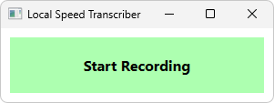

# Local Speech Transcriber

**Local Speech Transcriber** is a minimalistic voice typing application that uses OpenAI’s [Whisper](https://openai.com/index/whisper/) locally. 

## How It Works

This WPF application captures audio from your microphone and uses a local Whisper-based STT server to transcribe speech, automatically typing the result into any active window.

## Development Status

The application is functional and designed with extensibility in mind. Since it already meets my personal usage needs, further development will slow down. Below is a list of potential features I may implement in the future:

- Cross-platform support via a non-WPF presentation layer using **MAUI Blazor Hybrid**  
- Integration of a faster STT solution  
- UI options for configuring transcription settings (model, language, etc.)  
- Taskbar icon

## Usage

1. Clone this repository. This will also clone [Whisper Streaming](https://github.com/ufal/whisper_streaming) and [SimulStreaming](https://github.com/ufal/SimulStreaming).
2. Verify that Whisper Streaming runs successfully (needs Python and other dependencies).  
3. Update [`appsettings.json`](LocalSpeechTranscriber.Presentation.Wpf/appsettings.json) (or create `appsettings.Local.json`) with your configuration.  
4. Build and run [`LocalSpeechTranscriber.sln`](LocalSpeechTranscriber.sln).  
5. Start transcription using the global hotkey (default: `Ctrl+Alt+Shift+D`) or by clicking the **Start Recording** button.  
